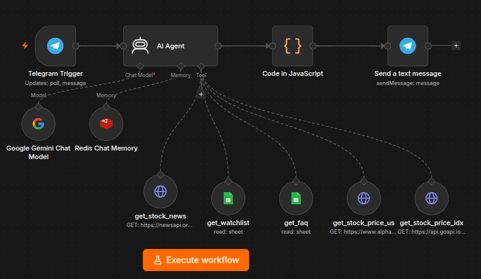

# Chatbot Saham

Chatbot investasi saham berbasis Telegram yang dibangun dengan n8n AI Agent, Google Gemini, Redis, Google Sheet, Alpha Vantage, GoAPI, dan NewsAPI. Chatbot dapat menjawab pertanyaan harga saham (IDX & AS), berita pasar, analisis sentimen, edukasi istilah investasi, dan menampilkan portofolio watchlist.

---

## Fitur

- Cek harga saham Indonesia secara real-time (via GoAPI / BEI)
- Cek harga saham Amerika Serikat secara real-time (via Alpha Vantage)
- Berita dan sentimen pasar terkini (via NewsAPI)
- Edukasi istilah investasi — PER, ROE, PBV, Dividen, dll (via Google Sheet FAQ)
- Portofolio dan watchlist personal (via Google Sheet)
- Memori percakapan per user (via Redis)
- 2 skenario fallback: pertanyaan di luar topik & data tidak ditemukan

---

## Arsitektur

```
Telegram
   |
   v
Telegram Trigger (n8n)
   |
   v
AI Agent — Google Gemini
   |                 |
   v                 v
Redis           Tools:
(Memory)        - get_stock_price_idx  (GoAPI)
   |            - get_stock_price_us   (Alpha Vantage)
   |            - get_stock_news       (NewsAPI)
   |            - get_watchlist        (Google Sheet)
   |            - get_faq              (Google Sheet)
   |
   v
Code JavaScript (format output)
   |
   v
Telegram (kirim balasan)
```


---

## Struktur Folder

```
chatbot-saham/
├── docker-compose.yml
├── .env.example
├── .env                    <- tidak di-commit
├── .gitignore
├── README.md
├── n8n-workflows/         <- export JSON workflow n8n
│
├── docs/
│   ├── watchlist.csv       <- sample data portofolio (import ke Google Sheet)
│   ├── faq_saham.csv       <- sample data FAQ (import ke Google Sheet)
│   └── import-ke-gsheet.md
├── scripts/
│   ├── start-local.sh      <- jalankan di lokal dengan ngrok
│   └── start-vps.sh        <- deploy ke VPS tanpa ngrok
```

---

## Prasyarat

Sebelum menjalankan project ini, pastikan sudah memiliki:

- Docker dan Docker Compose terinstall
- Akun Telegram dan bot token dari BotFather
- API key Google Gemini (dari aistudio.google.com)
- API key Alpha Vantage (dari alphavantage.co)
- API key NewsAPI (dari newsapi.org)
- API key GoAPI (dari app.goapi.io)
- Google Sheet yang sudah diisi data watchlist dan FAQ
- Service Account Google Cloud dengan akses ke Google Sheet
- Akun ngrok dan authtoken (untuk development lokal)

---

## Cara Menjalankan

### 1. Clone dan setup environment

```bash
git clone <repo-url>
cd chatbot-saham
cp .env.example .env
```

Buka file `.env` dan isi semua nilai yang dibutuhkan.

Generate encryption key untuk n8n:

```bash
openssl rand -hex 32
```

Paste hasilnya ke `N8N_ENCRYPTION_KEY` di file `.env`.

### 2. Jalankan di lokal (dengan ngrok)

```bash
chmod +x scripts/start-local.sh
./scripts/start-local.sh
```

Setelah container naik, buka ngrok dashboard di `http://localhost:4040` untuk mendapatkan public URL. Update `WEBHOOK_URL` di `.env` dengan URL tersebut, lalu restart n8n:

```bash
docker compose --profile local restart n8n
```

### 3. Jalankan di VPS (tanpa ngrok)

```bash
chmod +x scripts/start-vps.sh
./scripts/start-vps.sh
```

Pastikan `WEBHOOK_URL` di `.env` sudah diset ke IP atau domain VPS sebelum menjalankan perintah ini.

---

## Konfigurasi Environment

Salin `.env.example` ke `.env` lalu isi semua variabel berikut:

| Variabel | Keterangan |
|---|---|
| `TELEGRAM_BOT_TOKEN` | Token bot dari BotFather |
| `GEMINI_API_KEY` | API key Google Gemini |
| `ALPHA_VANTAGE_KEY` | API key Alpha Vantage (saham AS) |
| `NEWS_API_KEY` | API key NewsAPI |
| `GOAPI_KEY` | API key GoAPI (saham IDX) |
| `TZ` | Zona waktu sistem (contoh: Asia/Jakarta) |
| `N8N_PORT` | Port jaringan yang digunakan aplikasi n8n (default: 5678) |
| `N8N_VERSION` | Versi spesifik aplikasi n8n yang ingin dijalankan (contoh: latest atau 1.0.0) |
| `N8N_ENFORCE_SETTINGS_FILE_PERMISSIONS` | ` |
| `WEBHOOK_URL` | URL ngrok (lokal) atau domain VPS |
| `NGROK_AUTHTOKEN` | Token dari dashboard.ngrok.com (lokal only) |

---

## Setup Google Sheet

Import dua file CSV yang tersedia di folder `docs/` ke Google Sheet:

1. Buat spreadsheet baru
2. Rename tab default menjadi `watchlist`, lalu import `docs/watchlist.csv`
3. Buat tab baru bernama `faq`, lalu import `docs/faq_saham.csv`
4. Share spreadsheet ke email Service Account Google Cloud dengan akses Editor

Panduan lengkap ada di `docs/import-ke-gsheet.md`.

---

## Setup Credential n8n

Setelah n8n berjalan, buka `http://localhost:5678` dan tambahkan credential berikut:

- **Google Sheets**: pilih tipe Service Account, isi email dan private key dari file JSON yang didownload dari Google Cloud
- **Telegram**: masukkan bot token
- **HTTP Request** untuk GoAPI: tambahkan header `X-API-KEY` dengan nilai API key GoAPI
- **HTTP Request** untuk Alpha Vantage: tambahkan query parameter `apikey`
- **HTTP Request** untuk NewsAPI: tambahkan query parameter `apiKey`

---

## Akses Layanan

| Layanan | Alamat |
|---|---|
| n8n (editor workflow) | http://localhost:5678 |
| ngrok dashboard | http://localhost:4040 |
| Redis | localhost:6379 (internal) |

---

## Menghentikan Semua Service

```bash
# lokal
docker compose --profile local down

# VPS
docker compose down
```

Untuk menghapus semua data (volume):

```bash
docker compose down -v
```

---

## Sumber Data

| Data | Sumber | Keterangan |
|---|---|---|
| Harga saham Indonesia | GoAPI (app.goapi.io) | Real-time, BEI/IDX |
| Harga saham Amerika | Alpha Vantage | Free tier, 25 req/hari |
| Berita pasar | NewsAPI (newsapi.org) | Free tier, 100 req/hari |
| Watchlist & FAQ | Google Sheet | Data milik user sendiri |

---

## Catatan

- File `.env` tidak boleh di-commit ke Git. File ini sudah masuk `.gitignore`.
- Credentials n8n tersimpan di Docker volume `n8n_data` dan dienkripsi dengan `N8N_ENCRYPTION_KEY`.
- Redis dikonfigurasi dengan `maxmemory 256mb` dan policy `allkeys-lru`. Data session percakapan otomatis terhapus saat memory penuh.
- Untuk production di VPS, disarankan menggunakan HTTPS dengan reverse proxy seperti Nginx + Certbot.

<div align="center">
## 👤 Author

**[Agung Perdana]**

[](https://linkedin.com/in/agung-perdana-it)
[](https://github.com/AgungPerdana-IT)

</div>